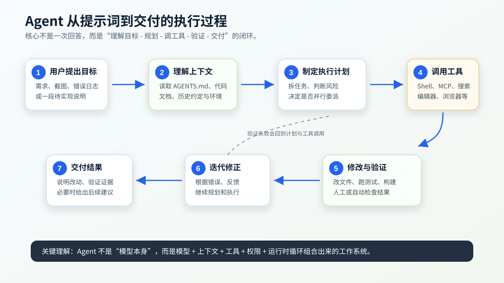
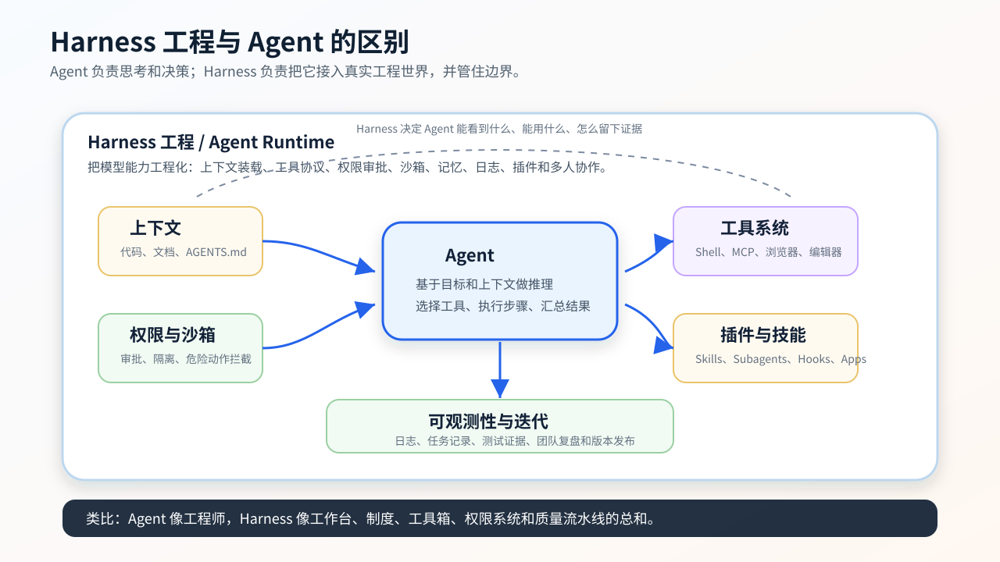

# AI 编程智能体、Harness 工程与插件化落地方案

> 本文根据 `思路.md` 整理，用于讲解 Claude Code、OpenAI Codex、Harness 工程、插件、Skill、MCP 和多 Agent 在企业开发项目中的落地方式。

## 0. 为什么以 Claude Code 和 Codex 为主线

在介绍 AI 编程 Agent 时，建议先讲 Claude Code 和 OpenAI Codex，而不是一开始就横向罗列所有国产或第三方 Agent 产品。原因不是其他产品不重要，而是这两个产品更适合作为“标准入口”：

1. Claude Code 和 Codex 都来自一线模型与 Agent 产品团队，很多概念会先在这些产品里被系统化，例如 `AGENTS.md`、Skill、MCP、插件、子 Agent、权限审批、沙箱和工具调用。
2. 其他 Agent 工具通常会兼容或借鉴这些概念。团队先理解这些“基础协议和工程形态”，再看其他产品时会更容易判断它们到底兼容了什么、缺了什么、适合什么场景。
3. 企业内部真正需要沉淀的不是某一个聊天窗口，而是一套可复用的开发工作流：项目规范、技能、工具连接、多 Agent 分工、质量校验和迭代机制。

Claude Code 官方将其描述为可读取代码库、编辑文件、运行命令并集成开发工具的 agentic coding tool。OpenAI 对 Codex 的描述也类似：Codex 是帮助编写、审查和交付代码的 AI coding agent，可以在本地工具中配合开发者，也可以把任务委派到云端执行。



## 1. 智能体 Agent 是什么

Agent 可以理解为“模型 + 上下文 + 工具 + 权限 + 执行循环”的组合。单独的大模型只能根据输入生成输出；Agent 则会围绕一个目标持续完成多个步骤：

1. 理解用户目标：读取用户提示词、截图、日志或需求说明。
2. 读取项目上下文：包括代码、文档、`AGENTS.md`、依赖配置、测试脚本和既有约定。
3. 制定执行计划：拆分任务，判断是否需要搜索资料、读取文件、改代码、跑测试或请求确认。
4. 调用工具：例如 Shell、文件编辑、MCP 工具、浏览器、数据库只读查询、CI、Issue 系统等。
5. 观察结果并迭代：根据命令输出、测试失败、类型错误或人工反馈继续修正。
6. 交付结果：说明改了什么、验证了什么、还有什么风险。

所以，Agent 的核心能力不是“回答得像人”，而是能把一个目标推进成可验证的工程结果。对开发团队来说，Agent 的价值主要体现在：

- 能理解整个代码库，而不是只补全一行代码。
- 能主动运行命令、修改文件、复现问题、执行测试。
- 能遵守项目规范，例如本项目的 BPMN 节点扩展目录、字段读写服务、保存前校验和提交前构建要求。
- 能通过 Skill、插件、MCP、子 Agent 把团队经验沉淀成可复用资产。

## 2. Harness 工程是什么

Harness 工程可以理解为 Agent 的“运行时工程”。如果说 Agent 是负责思考和决策的执行者，那么 Harness 就是它工作的环境、工具箱、制度和质量流水线。

一个完整 Harness 通常包含这些能力：

| 模块 | 作用 |
| --- | --- |
| 上下文装载 | 把 `AGENTS.md`、代码、文档、Issue、PR、设计稿等送入 Agent 可理解的上下文 |
| 工具协议 | 让 Agent 能通过统一接口调用 Shell、文件系统、MCP、浏览器、数据库、CI 等 |
| 权限控制 | 决定哪些命令能自动执行，哪些动作必须人工确认 |
| 沙箱隔离 | 限制文件写入、网络访问和危险操作，降低误操作风险 |
| 记忆机制 | 保存项目约定、团队偏好、历史经验和可复用结论 |
| 可观测性 | 记录 Agent 做了什么、为什么这么做、验证结果是什么 |
| 插件系统 | 把 Skill、MCP、子 Agent、Hook、工具配置打包分发 |



### Agent 和 Harness 的区别

| 对比项 | Agent | Harness 工程 |
| --- | --- | --- |
| 关注点 | 推理、规划、执行任务 | 提供运行环境、工具、权限、上下文和审计 |
| 输入 | 用户目标、上下文、工具结果 | 项目文件、配置、工具协议、权限策略、插件 |
| 输出 | 修改、分析、报告、测试结果 | 可控的执行过程、可复用能力、工程质量证据 |
| 风险 | 幻觉、误改、上下文不足 | 权限过宽、工具不稳定、日志不足、流程不可复用 |
| 企业价值 | 提升单次任务效率 | 把 AI 使用方式沉淀为团队工程资产 |

简单说：Agent 解决“谁来做”；Harness 解决“它在什么规则和工具环境里做”。

## 3. 插件是什么

插件是把 Agent 的能力扩展打包分发的一种方式。它不是单个提示词，而是一组可安装、可版本化、可共享的能力集合。

### Claude Code 插件可以包含什么

Claude Code 官方插件文档说明，插件用于扩展 Claude Code，并可包含 skills、agents、hooks、MCP servers 等能力。Claude Code 插件目录中常见组件包括：

| 组件 | 说明 |
| --- | --- |
| `.claude-plugin/plugin.json` | 插件清单，描述名称、版本、作者等元信息 |
| `skills/` | 可被模型按任务自动加载的 Skill |
| `agents/` | 自定义 Agent 或子 Agent 定义 |
| `hooks/` | 在工具调用、停止、子 Agent 生命周期等事件上执行脚本 |
| `.mcp.json` | MCP 服务配置 |
| `.lsp.json` | 语言服务配置，增强代码智能 |
| `monitors/` | 后台监控，例如日志或外部状态 |
| `bin/` | 插件启用时加入工具路径的可执行脚本 |
| `settings.json` | 插件启用时提供默认设置 |

### OpenAI / ChatGPT / Codex 侧的对应概念

OpenAI 侧需要分开看 ChatGPT Apps SDK 和 Codex 插件：

1. ChatGPT Apps SDK 更偏向“把业务应用接入 ChatGPT”。它基于 MCP，把工具、结构化结果和 iframe UI 组件连接起来，使 ChatGPT 能调用外部系统并渲染交互界面。
2. Codex 插件更偏向“把开发工作流打包给 Codex”。OpenAI Codex 官方文档说明，插件可以把 Skills、App integrations 和 MCP servers 打包成可复用工作流。

因此，Claude Code 插件和 Codex 插件更接近；ChatGPT Apps SDK 则更接近“面向终端用户的 ChatGPT 内应用”。

### Claude Code 与 OpenAI 相关插件能力差异

| 能力维度 | Claude Code 插件 | OpenAI Codex 插件 | ChatGPT Apps SDK |
| --- | --- | --- | --- |
| 主要场景 | 本地/IDE/终端开发工作流扩展 | Codex 开发工作流和应用集成 | 在 ChatGPT 中提供业务 App |
| 核心载体 | `.claude-plugin/plugin.json` | `.codex-plugin/plugin.json` | MCP server + Apps SDK UI |
| Skill | 支持 `skills/<name>/SKILL.md` | 支持 `SKILL.md`，可含 scripts、references、assets、agents | 不以 Skill 为主，重点是工具和 UI |
| 子 Agent | 支持 `agents/`，可被插件分发 | 支持 subagents 和并行工作流 | 通常通过应用后端和工具设计实现分工 |
| MCP | 支持 `.mcp.json` | 支持 MCP servers | 基于 MCP，MCP 是 server、model、UI 同步的骨架 |
| UI | 主要是开发者工具内交互 | Codex App/CLI/IDE 内交互 | iframe UI 组件嵌入 ChatGPT |
| Hook / 自动化 | 支持 hooks、monitors | 支持 hooks、skills、MCP 等配置能力 | 主要通过 MCP 工具、后端逻辑和 UI 交互实现 |
| 分发方式 | 插件目录、插件市场或私有仓库 | Codex 插件目录、本地 marketplace | ChatGPT Apps 提交流程和应用发布 |

## 4. 为什么引入 Superpowers 插件

Superpowers 这类插件的价值不在于“多了一堆提示词”，而在于它把优秀工程师常用的工作方法沉淀成可触发的 Skill 和流程，例如：

- 需求澄清和方案设计。
- 系统化调试。
- 测试驱动开发。
- 编写实施计划。
- 并行子 Agent 调度。
- 完成开发分支前的验证。
- 请求和接收代码审查。

这类插件可以解决团队使用 AI 时常见的几个问题：

1. 每个人提示词写法不同，产出质量不稳定。
2. Agent 容易跳过设计、测试和验证。
3. 复杂任务缺少拆分方法，导致上下文混乱。
4. 团队经验散落在个人聊天记录里，无法复用。

### 在 Claude Code 中安装和使用的典型过程

1. 准备插件仓库：可以使用官方 marketplace、企业内部 marketplace，或先把插件仓库克隆到本地。
2. 启用插件：通过 Claude Code 的插件命令或 `--plugin-dir ./plugin-name` 加载本地插件。
3. 检查组件：确认 skills、agents、hooks、MCP servers 是否出现在 Claude Code 中。
4. 迭代调试：修改插件后使用 `/reload-plugins` 或重启会话加载最新配置。
5. 团队分发：当插件稳定后，通过私有仓库或 marketplace 分发，配合版本号管理更新。

### 在 Codex 中安装和使用的典型过程

1. 使用 Codex 的 `/plugins` 打开插件目录，或维护本地 `.agents/plugins/marketplace.json`。
2. 插件目录指向包含 `.codex-plugin/plugin.json` 的插件文件夹。
3. 插件可以打包 Skills、App integrations 和 MCP servers。
4. 安装后重启会话，确保 Codex 重新发现插件、Skill 和 MCP 配置。
5. 对团队内部插件，建议使用项目级 marketplace，把插件来源固定到企业 Git 仓库。

## 5. 多 Agent 的使用方式

多 Agent 不是为了“显得高级”，而是为了解决复杂任务中的并行性和角色边界问题。一个主 Agent 可以像项目负责人一样拆任务，然后把独立子任务交给不同子 Agent：

| 子 Agent | 角色 | 典型任务 |
| --- | --- | --- |
| explorer | 代码库探索 | 分析模块职责、查找调用链、总结现有模式 |
| frontend-worker | 前端实现 | 修改组件、样式、交互和响应式表现 |
| validation-agent | 验证 | 跑测试、检查构建、复现错误 |
| doc-writer | 文档 | 维护 README、设计文档、迁移说明 |
| reviewer | 审查 | 从缺陷、风险、测试缺口角度审查改动 |

### 每个 Agent 对应一个文档

建议每个子 Agent 都有独立 Markdown 定义文件，内容至少包括：

- `name`：稳定、唯一、可读。
- `description`：什么时候应该使用它。
- `role`：它承担什么职责。
- `tools`：它能使用哪些工具，是否允许写文件。
- `memory`：它的记忆范围，例如 user、project 或 local。
- `working rules`：它必须遵守的工程规则。
- `handoff format`：它完成任务后如何向主 Agent 汇报。

示例结构：

```text
agents/
  explorer.md
  frontend-worker.md
  validation-agent.md
  reviewer.md
skills/
  bpmn-node-development/SKILL.md
  bpmn-validation/SKILL.md
  release-check/SKILL.md
.codex-plugin/
  plugin.json
```

### 记忆与自我迭代

Agent 的记忆不应该无边界增长。企业项目中建议使用“分层记忆”：

| 记忆层级 | 保存内容 | 更新方式 |
| --- | --- | --- |
| 全局记忆 | 通用偏好，例如语言、包管理器、提交习惯 | 低频人工维护 |
| 项目记忆 | 本项目架构、目录职责、测试命令、发布要求 | PR 审查后更新 |
| Agent 记忆 | 某个角色的经验，例如 reviewer 常见风险清单 | 每次复盘后小步更新 |
| 任务记忆 | 当前任务发现、临时约束、验证结果 | 任务结束后归档或清理 |

“自我迭代”不等于让 Agent 随意改自己的规则。更稳妥的流程是：

1. Agent 在任务结束时提出规则改进建议。
2. 人类或 reviewer Agent 审查建议是否真实、通用、无副作用。
3. 通过 PR 修改 Skill、Agent 定义或插件配置。
4. 跑最小验证，例如示例任务、Skill 触发测试、文档链接检查。
5. 发布新版本并记录 changelog。

## 6. 企业开发项目中的建议

建议把公司项目里沉淀出来的 Skill、MCP、多 Agent 定义和流程规范做成一个内部插件，并放到 GitHub 或企业 Git 仓库中管理。这样能带来几个好处：

1. 团队成员安装同一个插件，Agent 行为更一致。
2. 项目规范不只写在 Wiki 里，而是能进入 Agent 的执行过程。
3. 新人可以通过插件快速获得项目开发方法。
4. 每次流程优化都可以像代码一样评审、发布、回滚。

### 推荐仓库结构

```text
company-agent-workflows/
  README.md
  CHANGELOG.md
  .codex-plugin/
    plugin.json
  .claude-plugin/
    plugin.json
  skills/
    bpmn-node-development/
      SKILL.md
      references/
        bpmn-node-layout.md
        field-service-rules.md
    validation-before-submit/
      SKILL.md
      scripts/
        check-project.ps1
  agents/
    explorer.md
    reviewer.md
    validation-agent.md
  mcp/
    mcp.example.json
  docs/
    install-claude.md
    install-codex.md
    workflow-governance.md
```

### 插件迭代流程

企业内部使用时，最关键的问题是：实际项目里发现规则要改，怎么及时调整？

推荐使用以下流程：

1. 项目中发现问题：例如 Agent 经常错误修改 BPMN 页面主逻辑，或者忘记复用 `core/services` 字段读写服务。
2. 记录改进建议：在插件仓库创建 Issue，说明触发场景、错误行为、期望行为和示例文件。
3. 修改 Skill 或 Agent 定义：把规则写进对应 Skill，而不是散落在个人提示词里。
4. 加最小验证样例：可以是一个示例任务、一段检查脚本或一份“好/坏输出对照”。
5. PR 审查：至少检查三点：规则是否过窄、是否和现有流程冲突、是否会导致 Agent 误触发。
6. 发布版本：使用语义化版本，例如 `v0.3.0`。
7. 项目侧升级：在项目级 marketplace 或插件来源中升级版本，并在团队频道说明变更。
8. 观察效果：一段时间后根据实际任务表现继续微调。

### 对当前 BPMN 项目的落地建议

结合本项目的 `AGENTS.md`，可以优先沉淀这些 Skill：

| Skill | 触发场景 | 核心规则 |
| --- | --- | --- |
| `bpmn-node-development` | 新增或修改可插拔 BPMN 节点 | 节点必须放在 `src/features/bpmn-nodes/<node-name>/`，通过统一定义对象接入注册中心 |
| `bpmn-field-service` | 读写扩展字段 | 优先复用 `core/services`，不要在页面或节点内部重复拼 XML |
| `bpmn-validation` | 保存前校验、导入导出 | 校验规则放在 `src/features/bpmn-validation/`，避免堆在页面组件 |
| `bpmn-ui-change` | UI 交互改动 | 页面只做编排，复杂逻辑下沉到 features，改动后检查页面加载和关键按钮 |
| `submit-check` | 提交前 | 运行 `pnpm exec vue-tsc --noEmit` 和 `pnpm build`，记录验证结果 |

## 7. 附录：官方链接

### Claude / Anthropic

- Claude Code Overview: <https://code.claude.com/docs/en/overview>
- Claude Code Plugins: <https://code.claude.com/docs/en/plugins>
- Claude Code Subagents: <https://code.claude.com/docs/en/subagents>

### OpenAI / ChatGPT / Codex

- OpenAI Codex: <https://developers.openai.com/codex>
- Codex Plugins: <https://developers.openai.com/codex/plugins>
- Codex Build Plugins: <https://developers.openai.com/codex/plugins/build>
- Codex Agent Skills: <https://developers.openai.com/codex/skills>
- Codex Subagents: <https://developers.openai.com/codex/subagents>
- Codex AGENTS.md: <https://developers.openai.com/codex/guides/agents-md>
- ChatGPT Apps SDK: <https://developers.openai.com/apps-sdk>
- Apps SDK MCP Server: <https://developers.openai.com/apps-sdk/concepts/mcp-server>
- Apps SDK Define Tools: <https://developers.openai.com/apps-sdk/plan/tools>
- Apps SDK ChatGPT UI: <https://developers.openai.com/apps-sdk/build/chatgpt-ui>
- OpenAI Docs MCP: <https://developers.openai.com/learn/docs-mcp>

## 8. 资料依据摘要

本文中关于 Claude Code 的描述依据其官方文档：Claude Code 可读取代码库、编辑文件、运行命令并集成开发工具；Claude 插件可包含 skills、agents、hooks、MCP servers、LSP servers、monitors、bin 和 settings 等组件；Claude 子 Agent 使用 Markdown + YAML frontmatter 定义，支持工具权限、模型、记忆、隔离和生命周期 Hook 等字段。

本文中关于 OpenAI 的描述依据其官方文档：Codex 插件可把 Skills、App integrations 和 MCP servers 打包为可复用工作流；Codex Skill 使用 `SKILL.md` 搭配可选 scripts、references、assets、agents 等目录；Codex 子 Agent 可用于并行专门化任务；Apps SDK 基于 MCP，MCP server 通过工具列表、工具调用和 UI 资源把外部系统接入 ChatGPT。
